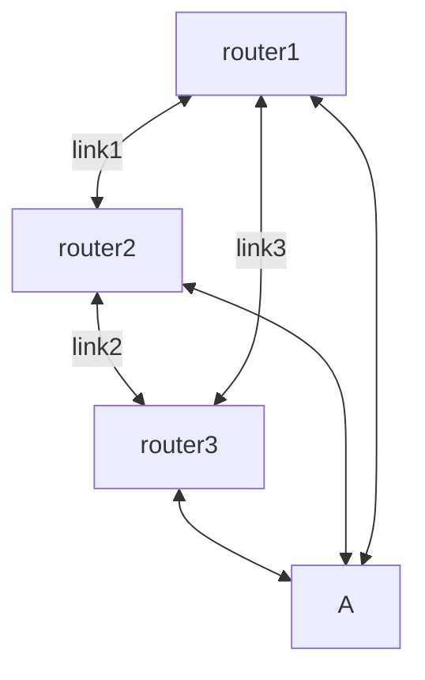

## Preparation

[stuff](../Media/Lab%208%20-%20HashMaps.docx)
new change


Math:

$F(x) = n^2 \cdot (\sqrt{\frac{log_{10} L^{15} }{\sqrt{n}}})$

Mermaid:



code
```c
#include <stdio.h>
#include <stdint.h>
uint64_t test;
void main() {
	for(test=1, test <= 1000, test++)
	{
		printf("%d\n", test);	
	}
}
```

```python
for test in range(1, 1000):
	print(test)
```

```php
for($test = 1, $test <= 1000, $test++)
{
	echo $test;
}
```

```java
public class Main {
	public static void main(String[] args) {
		for (int test = 1; test <= 1000; test++) {
			System.out.println(test);
		}
	}
}
```

```iosxr
config
router bgp 65001
	vrf inet
		neighbor 8.8.8.8
			remote-as 12345
			route-policy IPV4_GOOGLE_OUT_ROUTE_POLICY out
show commit changes diff
commit
end
```


## Maintenance Operation


## Rollback

[testing.pdf](../Media/testing.pdf)

## Verification


```
config t
int Gi0/0
	desc Test
end
copy run start
```

